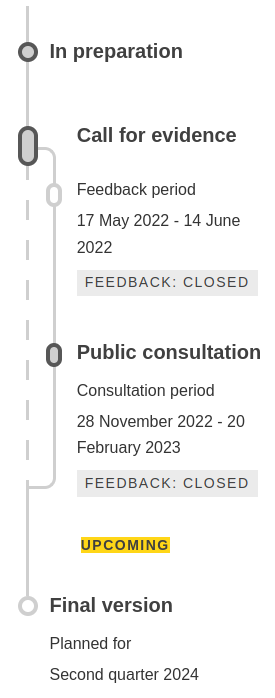

# EU Consumer Protection Law

This document introduces briefly EU legislation concerning consumer protection, with particular emphasis on unfair contract terms, which is the subject of this work.

## Overview

**European consumer law** concerns consumer protection within Europe, particularly through [European Union law][9] and the [European Convention on Human Rights][8] [\[1\]](#1).

The [Treaty on the Functioning of the European][2] Union [article 169][3] says that _"in order to promote the interests of consumers and to ensure a high level of consumer protection, the Union shall contribute to protecting the health, safety and economic interests of consumers, as well as to promoting their right to information, education and to organise themselves in order to safeguard their interests"_ [\[2\]](#2).

These are the main EU Directives on the matter:
* Product Liability Directive [85/374/EEC][4]
* Unfair Terms in Consumer Contracts Directive [93/13/EEC][5]
* Unfair Commercial Practices Directive [2005/29/EC][6]
* Consumer Rights Directive [2011/83/EU][7]

The EU customer protection system is based on the idea that _"the consumer is in a weak position vis-à-vis the seller or supplier, as regards both his bargaining power and his level of knowledge"_ [\[3\]](#3).

Consumer protection in EU a vivid subject under continous change. This is said on [Review of Consumer Law][11] website: _"In its 2020 consumer policy strategy, the “New Consumer Agenda”, the [European Commission](https://commission.europa.eu/index_en) announced that it would analyse whether additional legislation or other action was needed in the medium-term to ensure equal fairness online and offline. For that reason, the Commission launched in spring 2022 a [Fitness Check of EU consumer law on digital fairness][12]"_ [\[4\]](#4).

[Figure 1](#figure_1) shows a timeline with most important milestones of consumer protection legislation in EU:

<figure id="figure_1" class="image">
  
  <figcaption >Figure 1. Timeline with relevent milestones in EU consumer protection law.</figcaption>
</figure>

## The Unfair Contract Terms Directive [93/13/EEC][5]

_"The Unfair Contract Terms Directive (UTCD) protects consumers against unfair standard contract terms imposed by traders. It applies to all kinds of contracts on the purchase of goods and services, for instance online or off-line-purchases of consumer goods, gym subscriptions or contracts on financial services, such as loans"_ [\[5\]](#5). The Directive has a double objective: (1) _"the effective protection of consumers as the typically weaker party against unfair contract terms which are used by sellers or suppliers and have not been individually negotiated"_ [\[9\]](#9) and (2) _"contribute to the establishment of the Internal Market through the minimum harmonisation of the national rules aiming at this protection"_ [\[9\]](#9).

### Scope of the Directive

_"As soon as there is a seller or supplier on one side and a consumer on the other side, the contract is deemed to be covered by the [UTCD][5]"_ [\[9\]](#9).

_"This implies that the [UTCD][5] applies to all contracts concerning the purchase of goods and the supply of services and the Court has clarified that the [UTCD][5] is indeed intended to apply in all sectors of economic activity"_ [\[9\]](#9).

Every natural or legal person becomes a **seller or supplier** when engaged in professional activities, even if these activities are of a public nature or governed by public law. Organizations pursuing public interest or charitable goals are also considered **sellers or suppliers**, regardless of whether they operate on a not-for-profit basis [\[9\]](#9).

In the other hand, a **consumer** is someone usually in a weaker position compared to the **seller or supplier** in a contract. This status isn't just about knowledge or experience but also about the power balance in the contract [\[9\]](#9).

### What is an Unfair Term?

As defined by this Directive, any contract term is unfair (and consequently not binding to customers) if (1) it has not been negotiated individually and (2), contrary to the requirements of good faith, it produces a significant imbalance in the rigths and obligations of  the parties, to the detriment of the consumer [\[7\]](#7).

### Member States

Article 10 of the Directive states that _"Member States shall bring into force the laws, regulations and administrative provisions necessary to comply with this Directive no later than 31 December 1994"_ [\[7\]](#7).

Member States may also enforce stricter rules than the ones provided by the [UCTD][5]. They are also able to _"apply the national rules transposing the UCTD to contract terms that were negotiated individually or to business-to-business relations or to transactions between consumers"_ [\[9\]](#9).

_"They may, for instance, adopt a ‘black list’ of contract terms which are always considered to be unfair without requiring a case-by-case assessment under the general unfairness test of Article 3 of the UCTD"_ [\[9\]](#9). This is the case of Spain's [Ley 7/1998, sobre condiciones generales de la contratación][21], which defines a non-exhaustive list of terms that shall be deemed as unfair.

### Directive Ammendments

Two Directives have ammended the [Unfair Contract Terms Directive][5]: the [Consumer Rights Directive][7] (2011) and the [Omnibus Directive][15] (2019), adding the articles 8a and 8b respectively. Check [EUR-Lex][27] for futher details.

## Other Relevant Directives and Regulations

### Unfair Commercial Practices Directive [2005/29/EC][6]

_"The objective of the EU Directive on unfair commercial practices from 2005 was to boost consumer confidence and make it easier for businesses, especially small and medium-sized enterprises, to trade across borders. It is the overarching EU legislation regulating unfair commercial practices that occur before, during and after a business-to-consumer transaction has taken place"_ [\[10\]](#10).

_"EU rules on unfair commercial practices enable national enforcers to curb a broad range of unfair business practices. Examples of unfair business practices include untruthful information to consumers or aggressive marketing techniques to influence their choices"_ [\[10\]](#10).

### Consumer Protection Cooperation Regulation [(EU) 2017/2394][24]

> Section created with the aid of [OpenAI's ChatGPT][18].\
> This section offers a summary of [Consumer Protection Cooperation Network][25].

Enforcing consumer rights in the EU involves cooperation among national authorities, empowered by regulations like the [Consumer Protection Cooperation Regulation][24]. This cooperation strengthens the ability to address cross-border consumer issues efficiently. National authorities have robust powers to combat rogue traders, including ordering corrective actions on scam websites and closing non-compliant accounts. They can also negotiate commitments from businesses to rectify unfair practices, such as misleading subscription schemes. The European Commission plays a significant role in coordinating actions against practices harming EU consumers, with potential sanctions for non-compliant businesses. Additionally, consumer protection actors can signal emerging threats, leading to corrective actions by authorities:
  * **Competent Authorities**: Public bodies in member states responsible for enforcing consumer protection laws.
  * **Single Liaison Office (SLO)**: Coordinates activities among competent authorities and other CPC actors within each member state.
  * **Designated Bodies**: Entities instructed by competent authorities to gather evidence or take enforcement measures.
  * **External Entities**: Consumer associations, trade organizations, or designated bodies reporting emerging threats and sharing information with enforcement authorities.

Competent authorities, Single Liaison Offices, and designated bodies collaborate to enforce consumer laws effectively, with external entities contributing to the alert mechanism for emerging threats.

### Consumer Rights Directive [2011/83/EU][7]

> Section created with the aid of [OpenAI's ChatGPT][18].

The [Consumer Rights Directive (CRD)][7] harmonizes consumer rules across the EU, ensuring consistent rights for consumers regardless of where they shop. It covers various aspects, such as information provision before purchase, right to cancel online purchases, and enforcement mechanisms. Member States must inform the Commission about their regulatory choices under the directive. The Commission provides guidance on interpreting and applying the CRD, covering topics like online marketplaces, personalized pricing, and enforcement. Evaluations assess the effectiveness of the directive, leading to proposals for revisions and updates. Specific chapters of the directive address information requirements for different types of contracts, including distance and off-premises contracts, delivery rules, and general provisions on enforcement and penalties [\[6\]](#6).

## New Deal for Consumers

_"In 2017 the European Commission carried out a [thorough evaluation of existing consumer rules][17]. It showed that the current EU consumer legalisation works well, but stressed that the rules were not applied and enforced effectively across the EU. There is also a need to raise awareness among consumers and businesses about their rights and obligations. The review identified targeted revisions to eliminate unnecessary costs for traders and to modernise the rules in the light of today's global trends and new business practices"_ [\[6\]](#6).

_"The Commission's New Deal for Consumers is a proposal that will guarantee that all European consumers fully benefit from their rights. It will also strengthen the public and private enforcement of these rules, ensuring that authorities have the power to impose deterrent sanctions and consumers can access compensation if their rights are breached"_ [\[6\]](#6).

Under the New Deal for Consumers two new Directives were proposed: the [Omnibus Directive][15] (27 November 2019) and the [Directive on Representative Actions][16] (25 November 2020). These are the Directives that were updated:
* Unfair Terms in Consumer Contracts Directive [93/13/EEC][5]
* Unfair Commercial Practices Directive [2005/29/EC][6]
* Consumer Rights Directive [2011/83/EU][7]
* Consumer protection in the indication of the prices of products offered to consumers [98/6/EC][14]

### Omnibus Directive

Among many other ammendments in multiple Directives, this Directive ammends the [Unfair Terms in Consumer Contracts Directive][5]. The article 8b is introduced, which urges Member States to lay down the rules on penalties applicable to infringements and provides a non-exhaustive and indicative criteria that Member States must consider when imposing penalties [\[7\]](#7).

### Directive on Representative Actions

_"Representative actions are actions brought by qualified entities before national courts or administrative authorities on behalf of groups of consumers to seek injunctive measures (i.e. to stop trader’s unlawful practices), redress measures (such as refund, replacement, repair) or both injunctive and redress measures. The Directive aims to protect the collective interests of consumers in many areas of law and economic sectors, such as data protection, financial services, travel and tourism, energy and telecommunications"_ [\[8\]](#8).

## New Consumer Agenda

> Section created with the aid of [OpenAI's ChatGPT][18].\
> This section offers a summary of [New Consumer Agenda: European Commission to empower consumers to become the driver of transition
][26].

The New Consumer Agenda, launched by the European Commission in 2020, aims to empower European consumers in the green and digital transitions, enhance consumer protection during and after the COVID-19 pandemic, and set priorities for the next five years. Key aspects include: addressing COVID-19 impacts, green transition, digital transformation, effective enforcement by member states, specific needs of vulnerable groups and international cooperation.
The agenda builds upon existing consumer protection frameworks, reflects input from public consultations, and aligns with broader EU initiatives such as the Green Deal and Circular Economy Action Plan.

### Review of EU consumer law

_"In its 2020 consumer policy strategy, the [New Consumer Agenda][26], the Commission announced that it would analyse whether additional legislation or other action was needed in the medium-term to ensure equal fairness online and offline. For that reason, the Commission launched in spring 2022 a [Fitness Check of EU consumer law on digital fairness][12]. It will determine whether the existing key horizontal consumer law instruments remain adequate for ensuring a high level of consumer protection in the digital environment. The Fitness Check will evaluate the Unfair Commercial Practices Directive, Consumer Rights Directive and Unfair Contract Terms Directive. It examines the adequacy of these Directives in dealing with consumer protection issues such as consumer vulnerabilities, dark patterns, personalisation practices, influencer marketing, contract cancellations, subscription service contracts, marketing of virtual items, the addictive use of digital products, and others"_ [\[12\]](#12).

These are the Directive under examination by the fitness check:
  * Unfair Commercial Practices Directive [2005/29/EC][6]
  * Consumer Rights Directive [2011/83/EU][7]
  * Unfair Terms in Consumer Contracts Directive [93/13/EEC][5]

[Figure 2](#figure_2) shows the fitness check stages. The public consultation is over and the final version is scheduled for second quarter of 2024. Depending on its conclusions, major ammendments could be introduced to the [UCTD][5]. 

<figure id="figure_2" class="image">
  
  <figcaption >Figure 2. Timeline of the Fitness Check of EU consumer law on digital fairness.</figcaption>
</figure>

## References

<a id="1"/> \[1\] [https://en.wikipedia.org/wiki/European_consumer_law][1]\
<a id="2"/> \[2\] [https://eur-lex.europa.eu/legal-content/EN/TXT/?uri=celex%3A12016ME%2FTXT#d1e4630-47-1][3]\
<a id="3"/> \[3\] [https://eur-lex.europa.eu/legal-content/EN/TXT/PDF/?uri=CELEX:62010CJ0618][10]\
<a id="4"/> \[4\] [https://commission.europa.eu/law/law-topic/consumer-protection-law/review-eu-consumer-law_en][11]\
<a id="5"/> \[5\] [https://commission.europa.eu/law/law-topic/consumer-protection-law/consumer-contract-law/unfair-contract-terms-directive_en][19]\
<a id="6"/> \[6\] [https://ec.europa.eu/commission/presscorner/detail/es/MEMO_18_2821][13]\
<a id="7"/> \[7\] [https://eur-lex.europa.eu/legal-content/EN/TXT/?uri=CELEX%3A01993L0013-20220528][5]\
<a id="8"/> \[8\] [https://commission.europa.eu/law/law-topic/consumer-protection-law/representative-actions-directive_en][16]\
<a id="9"/> \[9\] [https://eur-lex.europa.eu/legal-content/EN/TXT/?uri=uriserv:OJ.C_.2019.323.01.0004.01.ENG&toc=OJ:C:2019:323:TOC][20]\
<a id="10"/> \[10\] [https://commission.europa.eu/law/law-topic/consumer-protection-law/unfair-commercial-practices-law/unfair-commercial-practices-directive_en][22]\
<a id="11"/> \[11\] [https://commission.europa.eu/law/law-topic/consumer-protection-law/consumer-contract-law/consumer-rights-directive_en][23]\
<a id="12"/> \[12\] [https://ec.europa.eu/info/law/better-regulation/have-your-say/initiatives/13413-Digital-fairness-fitness-check-on-EU-consumer-law_en][12]

[1]: https://en.wikipedia.org/wiki/European_consumer_law
[2]: https://eur-lex.europa.eu/legal-content/EN/TXT/?uri=celex%3A12016ME%2FTXT
[3]: https://eur-lex.europa.eu/legal-content/EN/TXT/?uri=celex%3A12016ME%2FTXT#d1e4630-47-1
[4]: https://eur-lex.europa.eu/legal-content/EN/ALL/?uri=celex%3A31985L0374
[5]: https://eur-lex.europa.eu/legal-content/EN/TXT/?uri=celex%3A31993L0013
[6]: https://eur-lex.europa.eu/legal-content/EN/TXT/?uri=celex%3A32005L0029
[7]: https://eur-lex.europa.eu/legal-content/EN/TXT/?uri=celex%3A32011L0083
[8]: https://www.echr.coe.int/documents/d/echr/convention_ENG
[9]: https://eur-lex.europa.eu/homepage.html
[10]: https://eur-lex.europa.eu/legal-content/EN/TXT/PDF/?uri=CELEX:62010CJ0618
[11]: https://commission.europa.eu/law/law-topic/consumer-protection-law/review-eu-consumer-law_en
[12]: https://ec.europa.eu/info/law/better-regulation/have-your-say/initiatives/13413-Digital-fairness-fitness-check-on-EU-consumer-law_en
[13]: https://ec.europa.eu/commission/presscorner/detail/es/MEMO_18_2821
[14]: https://eur-lex.europa.eu/legal-content/EN/TXT/?uri=CELEX%3A31998L0006
[15]: https://eur-lex.europa.eu/eli/dir/2019/2161/oj
[16]: https://eur-lex.europa.eu/legal-content/EN/TXT/?uri=uriserv:OJ.L_.2020.409.01.0001.01.ENG
[17]: https://ec.europa.eu/newsroom/just/items/59332
[18]: https://chat.openai.com/auth/login
[19]: https://commission.europa.eu/law/law-topic/consumer-protection-law/consumer-contract-law/unfair-contract-terms-directive_en
[20]: https://eur-lex.europa.eu/legal-content/EN/TXT/?uri=uriserv:OJ.C_.2019.323.01.0004.01.ENG&toc=OJ:C:2019:323:TOC
[21]: https://www.boe.es/buscar/act.php?id=BOE-A-1998-8789
[22]: https://commission.europa.eu/law/law-topic/consumer-protection-law/unfair-commercial-practices-law/unfair-commercial-practices-directive_en
[23]: https://commission.europa.eu/law/law-topic/consumer-protection-law/consumer-contract-law/consumer-rights-directive_en
[24]: https://eur-lex.europa.eu/eli/reg/2017/2394/oj
[25]: https://commission.europa.eu/live-work-travel-eu/consumer-rights-and-complaints/enforcement-consumer-protection/consumer-protection-cooperation-network_en
[26]: https://ec.europa.eu/commission/presscorner/detail/en/ip_20_2069
[27]: https://eur-lex.europa.eu/legal-content/EN/TXT/?uri=CELEX%3A01993L0013-20220528