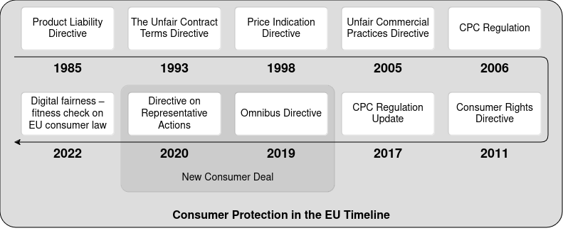

# EU Consumer Law Protection

**European consumer law** concerns consumer protection within Europe, particularly through [European Union law][9] and the [European Convention on Human Rights][8] [\[1\]](#1).

The [Treaty on the Functioning of the European][2] Union [article 169][3] says that _"in order to promote the interests of consumers and to ensure a high level of consumer protection, the Union shall contribute to protecting the health, safety and economic interests of consumers, as well as to promoting their right to information, education and to organise themselves in order to safeguard their interests"_ [\[2\]](#2).

These are the main EU Directives on the matter:
* Product Liability Directive 1985 ([85/374/EEC][4])
* Unfair Terms in Consumer Contracts Directive 1993 ([93/13/EEC][5])
* Unfair Commercial Practices Directive 2005 ([2005/29/EC][6])
* Consumer Rights Directive 2011 ([2011/83/EU][7])

**TODO: hacer referencia que son los estados miembros los que tienen la última palabra!**

The EU customer protection system is based on the idea that _"the consumer is in a weak position vis-à-vis the seller or supplier, as regards both his bargaining power and his level of knowledge"_ [\[3\]](#3).

Consumer protection in EU a vivid subject under continous change. This is said on [Review of Consumer Law][11] website: _"In its 2020 consumer policy strategy, the “New Consumer Agenda”, the [European Commission](https://commission.europa.eu/index_en) announced that it would analyse whether additional legislation or other action was needed in the medium-term to ensure equal fairness online and offline. For that reason, the Commission launched in spring 2022 a [Fitness Check of EU consumer law on digital fairness][12]"_ [\[4\]](#4).

[Figure 1](#figure_1) shows a timeline with most important milestones of consumer protection legislation in EU:

## New Consumer Deal

## New Consumer Agenda

## References

 \[1\] [https://en.wikipedia.org/wiki/European_consumer_law][1]\
 \[2\] [https://eur-lex.europa.eu/legal-content/EN/TXT/?uri=celex%3A12016ME%2FTXT#d1e4630-47-1][3]\
 \[3\] [https://eur-lex.europa.eu/legal-content/EN/TXT/PDF/?uri=CELEX:62010CJ0618][10]\
 \[4\] [https://commission.europa.eu/law/law-topic/consumer-protection-law/review-eu-consumer-law_en][11]

[1]: https://en.wikipedia.org/wiki/European_consumer_law
[2]: https://eur-lex.europa.eu/legal-content/EN/TXT/?uri=celex%3A12016ME%2FTXT
[3]: https://eur-lex.europa.eu/legal-content/EN/TXT/?uri=celex%3A12016ME%2FTXT#d1e4630-47-1
[4]: https://eur-lex.europa.eu/legal-content/EN/ALL/?uri=celex%3A31985L0374
[5]: https://eur-lex.europa.eu/legal-content/EN/TXT/?uri=celex%3A31993L0013
[6]: https://eur-lex.europa.eu/legal-content/EN/TXT/?uri=celex%3A32005L0029
[7]: https://eur-lex.europa.eu/legal-content/EN/TXT/?uri=celex%3A32011L0083
[8]: https://www.echr.coe.int/documents/d/echr/convention_ENG
[9]: https://eur-lex.europa.eu/homepage.html
[10]: https://eur-lex.europa.eu/legal-content/EN/TXT/PDF/?uri=CELEX:62010CJ0618
[11]: https://commission.europa.eu/law/law-topic/consumer-protection-law/review-eu-consumer-law_en
[12]: https://ec.europa.eu/info/law/better-regulation/have-your-say/initiatives/13413-Digital-fairness-fitness-check-on-EU-consumer-law_en
